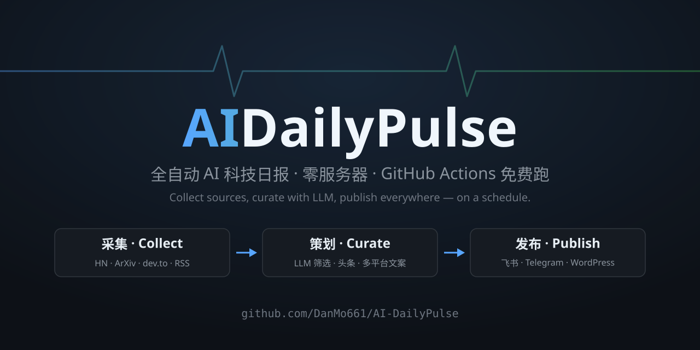

<div align="center">
  

  [](https://github.com/DanMo661/AI-DailyPulse/actions/workflows/daily-digest.yml)
  [](https://www.python.org/)
  [](LICENSE)

  **全自动 AI 科技日报** —— 抓取 HN / ArXiv / dev.to / 技术 RSS，LLM 筛选改写并策划成一期早报，
  自动推送飞书 / Telegram / WordPress，并生成公众号 / 小红书 / 知乎 / 抖音文案。

  Fork + 填几个 Secret，GitHub Actions 免费跑，**零服务器**。

  [简体中文](./README.md) | [English](./README_EN.md)
</div>

---

## 它每天做什么

每天北京时间 **08:00 / 20:00** 各跑一期，流程全在 GitHub Actions 里：

| 步骤 | 做什么 |
|---|---|
| 📡 采集 | 并行抓 HN、ArXiv cs.AI、dev.to、hnrss、TechCrunch、Simon Willison、lobste.rs 等约 30 篇，URL 去重 |
| 🔍 筛选 | LLM 逐篇判定相关性：拒营销软文和噪音，留下的生成中文标题 + 核心要点 |
| 📝 策划 | 一次"主编"调用：选出 **1 篇头条**（120~180 字正文）+ **4 篇重点**，写成早报 |
| 🖼️ 配图 | 自动抓头条原文的 `og:image` 作为封面，随每期归档到 `covers/` |
| 📣 文案 | 头条自动改写成 5 个平台风格的文案（公众号 / 小红书 / 知乎 / Telegram / 抖音） |
| 🚀 发布 | 飞书整期推送 · Telegram 分段推送 · WordPress 存草稿 · 其余平台存文件人工发 |

护栏：单篇筛选的 LLM 调用失败率 ≥ 50% 时当期自动中止（宁可不出刊，不推半成品）；抓不到封面不阻塞流程。

## 效果预览（真实产出，非摆拍）

> ### Claude Fable 5.1 发布，新基准测试成绩亮眼
>
> Anthropic 今日发布 Claude Fable 5.1，在 Terminal-Bench-Science 0.1 基准测试中取得 52.6% 的得分，官方宣称其在编码和知识工作能力上均有显著提升……
>
> **📌 其他重点**
> 1. **Claude 新系统提示词严防歌词复制** — Anthropic 公开 Claude 消费应用系统提示词及历史变更，新增明确禁止复现歌曲歌词的条款，以规避版权风险。
> 2. **CERN 工业计算机从 RHEL 迁移至 Debian** — 长期使用 RHEL 的 CERN 宣布将工业计算机系统迁移至 Debian，此举可能对开源生态和工业计算领域产生深远影响。
> 3. **Python 3.15 候选版 2 发布** — Python 3.15 进入候选阶段，仅允许修复 bug，正式版预计 10 月发布。
>
> *（节选，完整一期见 [docs/example_digest.md](docs/example_digest.md)）*

配套的小红书文案、知乎文案等自动生成产物，见 [docs/example_digest.md](docs/example_digest.md) 末尾。

## 5 分钟上手

```bash
# 没有服务器要求——你只需要一个 GitHub 账号和一个 LLM API Key
```

1. **Fork 本仓库**
2. 进入你自己 fork 的 **Settings → Secrets and variables → Actions**，添加 secret：

   | Secret | 必填 | 说明 |
   |---|---|---|
   | `LLM_API_KEY` | ✅ | 任意 OpenAI 兼容 API：DeepSeek / OrcaRouter / OpenAI / 硅基流动… |
   | `LLM_BASE_URL` | 可选 | 默认 `https://api.deepseek.com`；接 OrcaRouter 填 `https://api.orcarouter.ai/v1` |
   | `LLM_MODEL` | 可选 | 默认 `deepseek-chat`；OrcaRouter 例：`deepseek/deepseek-chat` |
   | `FEISHU_WEBHOOK_URL` + `FEISHU_SECRET` | 渠道 | 飞书群机器人，国内推送首选 |
   | `TELEGRAM_BOT_TOKEN` + `TELEGRAM_CHANNEL` | 渠道 | Telegram 频道推送 |
   | `WP_URL` + `WP_USER` + `WP_APP_PASSWORD` | 渠道 | WordPress，自动存**草稿**不直接发布 |

   > 曾配置过旧名 `DEEPSEEK_API_KEY` / `DEEPSEEK_BASE_URL`？仍然兼容，可不迁移。

3. 进入 **Actions** 页，启用 workflow（GitHub 默认禁用 fork 仓库的定时任务），然后 **Run workflow** 手动跑一次验证
4. 完成。之后每天 08:00 / 20:00 自动出刊

**成本**：一期约 35 次 LLM 调用（30 篇筛选 + 1 次主编 + 5 平台文案），用 DeepSeek 官方 API 每期约几分钱，接免费档模型可做到 0 成本。

### 本地运行（可选）

```bash
python -m venv .venv
pip install -r requirements.txt
cp .env.example .env    # 填入 LLM_API_KEY
python src/main.py                    # 全流程
python src/main.py --collect-only     # 只抓取，不耗 LLM 额度
```

## 发布渠道一览

| 渠道 | 方式 | 自动化程度 |
|---|---|---|
| 飞书 | 群机器人 webhook，整期一条消息 | 全自动 |
| Telegram | Bot API，按章节分段推送 | 全自动 |
| WordPress | REST API 存草稿（人工过目后再发） | 全自动 |
| 公众号 / 知乎 / 抖音 | 文案生成后存 `output/manual_review/` | 人工发布 |
| 小红书 | 文案存文件；另有 Playwright 半自动发布脚本（实验性） | 本地脚本 |

## 自定义

- **信源**：`src/config.py` 的 `SOURCES` / `RSS_FEEDS`，任意 RSS 都能加
- **出刊时间**：`.github/workflows/daily-digest.yml` 的 cron（现在是北京时间 08:00 / 20:00）
- **选题标准与文风**：`src/process.py` 里的各个 PROMPT
- **单期篇幅**：`src/config.py` 的 `MAX_TOTAL_ARTICLES`

## FAQ

**我的 API Key 安全吗？**
Key 只存在你自己 fork 的 GitHub Secrets 里，流水线只调用你自己配置的供应商，没有第三方中转。

**为什么 WordPress 只存草稿？**
AI 生成的内容先人工过一眼再发，是对读者和你的域名负责。

**某天一个源都没抓到怎么办？**
按"正常日"处理，静默跳过，不会发空刊。采集状态通过 `data/seen_urls.json` + Actions cache 跨期去重。

**fork 后定时任务没跑？**
GitHub 默认禁用 fork 仓库的 scheduled workflow，Actions 页手动启用一次即可；另外仓库 60 天无提交，schedule 会被 GitHub 自动暂停，重新 enable 即可。

**免责声明**
小红书发布脚本为非官方途径，存在平台风控风险，请自行评估；自动生成内容请在发布前人工审核，并遵守各平台服务条款。

## License

[MIT](LICENSE)
